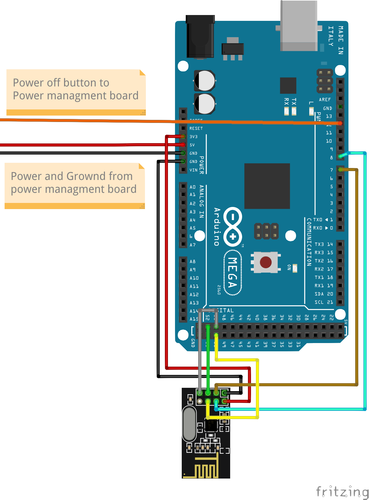

<h1 align="center">Dude DoorBell™</h1>

DoorBell made while in dude project.

  

DoorBell made with RF24 transceiver on arduino and rasberry pi

## About
### Raspberry
Raspberry uses [archlinuxarm](https://archlinuxarm.org) as it operating system.  Recever brige uses [rf24](https://aur.archlinux.org/packages/rf24) and  [cpp-httplib](https://aur.archlinux.org/packages/cpp-httplib) libraries.  Systemd service unit is used to start and keep program running in case of crash.

### Arduino
Arduino is Elegoo Mega 2560 Rev3.  Relays are used to conserve on power usage and arduino is only run on button press.  Arduino turns it self off after a given time.  Arduino transmits message to raspberry with nrf24l01 transmitters 

## Connections
### Arduino

Power managemnt             |  sender board
:-------------------------:|:-------------------------:
  |  

### Raspberry

# Cad
Cad made with FreeCAD and printed with Eryone Thinker S v2.0 FDM 3d Printer

## License

  <a href="https://www.gnu.org/licenses/gpl-3.0.en.html">GPL-3.0</a>
   
  

